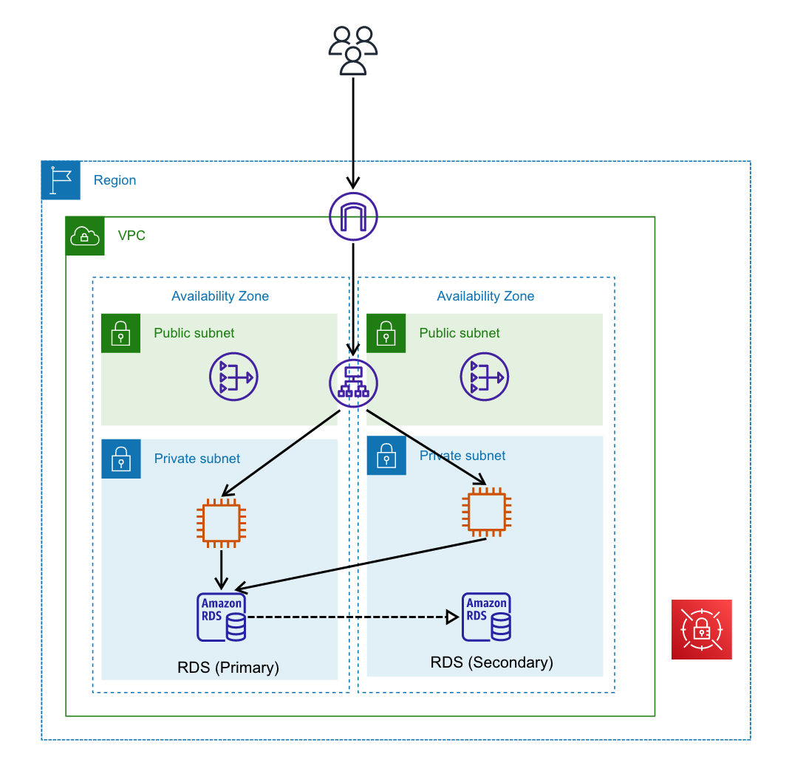

# HTTP通信を行うEC2アプリケーションのアーキテクチャサンプル
Application Load Balancer(ALB)、EC2、RDSを用いたアプリケーションのサンプルです。HTTPS通信ではなく、HTTP通信を行います。

## アーキテクチャ図

## 使用サービス
* Application Load Balancer(ALB)  
ロードバランサに使用します。リスナーにEC2のターゲットグループを設定し、各EC2インスタンスにリクエストを振り分けます。
* EC2  
アプリケーションサーバです。サンプルではプライベートIPアドレスを含む、固定文字列を返します。
* RDS  
RDBです。マルチAZ構成にしています。
* NATゲートウェイ  
プライベートサブネット内のEC2インスタンスが外部のインターネットからソフトウェアをダウンロードできるようにするため、設置しています。
* AWS Secrets Manager  
RDSのパスワードを保存します。
