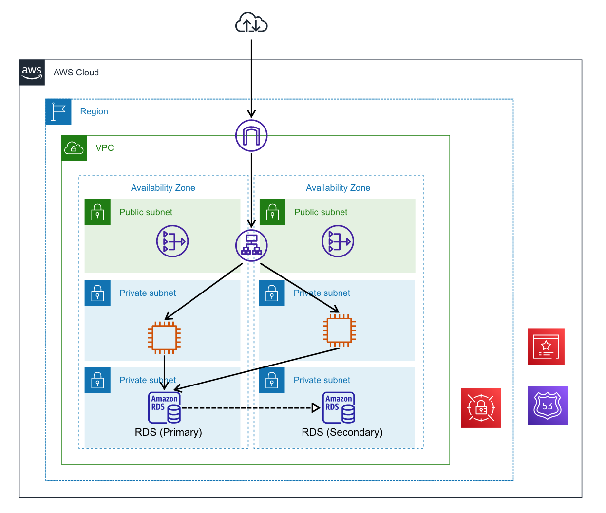

# HTTPS通信を行うEC2アプリケーションのアーキテクチャサンプル
Application Load Balancer(ALB)、EC2、RDSを用いたアプリケーションのサンプルです。AWS Certificate Manager(ACM)を用いて公開鍵証明書を発行し、HTTPS通信を行います。

## アーキテクチャ図

## 使用サービス
* Application Load Balancer(ALB)  
ロードバランサに使用します。リスナーにEC2のターゲットグループを設定し、各EC2インスタンスにリクエストを振り分けます。
* EC2  
アプリケーションサーバです。サンプルではプライベートIPアドレスを含む、固定文字列を返します。
* RDS  
RDBです。マルチAZ構成にしています。
* NATゲートウェイ  
プライベートサブネット内のEC2インスタンスが外部のインターネットからソフトウェアをダウンロードできるようにするため、設置しています。
* AWS Secrets Manager  
RDSのパスワードを保存します。
* Route53
専用のホストゾーンを作成し、アプリケーションのDNSレコードを管理します。このテンプレートでは、ルートのホストゾーンから子のホストゾーンを作成します。
* AWS Certificate Manager(ACM)  
HTTPS通信に使用する公開鍵証明書発行します。認証はドメイン認証を使用します。

## デプロイ方法
`cdk deploy --parameters rootHZId=Z10xxxxxxxxxxxxxxxxxx --parameters rootHZName=example.com --parameters subDomainPrefix=https-app`

上記コマンドで、`https-app.example.com`に紐づくアプリケーションをデプロイします。  
`rootHZId`、`rootHZName`には親となる既存のホストゾーン情報を入力します。`subDomainPrefix`にはサブドメインの先頭部分の名前を入力します。
