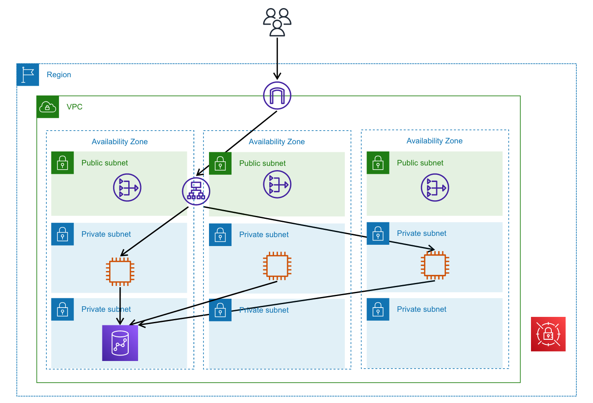

# Redshiftを含むアーキテクチャサンプル
Application Load Balancer(ALB)、EC2、Redshiftを用いたアプリケーションのサンプルです。  
Redshiftは現在(2022/07)、CDKのL2対応がアルファ版のため、Redshift部分のみL1で書いています。

## アーキテクチャ図

## 使用サービス
* Application Load Balancer(ALB)  
ロードバランサに使用します。リスナーにEC2のターゲットグループを設定し、各EC2インスタンスにリクエストを振り分けます。
* EC2  
アプリケーションサーバです。サンプルではEC2のプライベートIPアドレスを含む、固定文字列を返します。
* Redshift  
Redshiftのクラスターです。
* NATゲートウェイ  
プライベートサブネット内のEC2インスタンスが外部のインターネットからソフトウェアをダウンロードできるようにするため、設置しています。
* AWS Secrets Manager  
Redshiftのパスワードを保存します。
