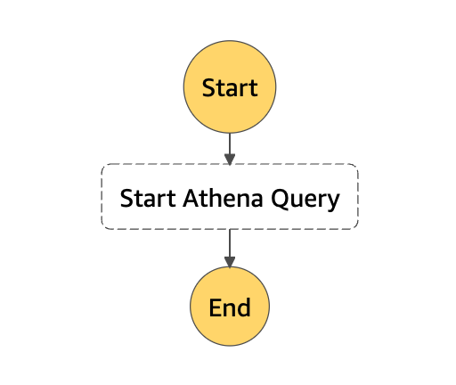

# Step Functions Athena
Athenaを呼び出すStep FunctionsステートマシンのCDKテンプレートです。



```json
{
  "StartAt": "Start Athena Query",
  "States": {
    "Start Athena Query": {
      "End": true,
      "Type": "Task",
      "Resource": "arn:aws:states:::athena:startQueryExecution.sync",
      "Parameters": {
        "QueryString.$": "$.queryString",
        "ResultConfiguration": {
          "OutputLocation": "s3://query-results-bucket/folder/"
        },
        "WorkGroup": "primary"
      }
    }
  }
}
```

Step Functionsの入力SQL(`queryString`)をAthenaで実行します。  
```json
{
  "queryString": "SELECT * FROM default.sample_catalog limit 10;"
}
```

クエリ結果の保存先バケット(OutputLocation)は適宜指定してください。

`integrationPattern`を変更することで、「Athenaのクエリの実行完了を待つ」か「Athenaのクエリ実行リクエストをするのみ」かを変更できます。  
なお、ステートマシンを`Expressワークフロー`にする場合は「Athenaのクエリの実行完了を待つ」ことはできません。

## 参考リンク
https://docs.aws.amazon.com/step-functions/latest/dg/connect-athena.html  
https://docs.aws.amazon.com/cdk/api/v2/docs/aws-cdk-lib.aws_stepfunctions.StateMachine.html  
https://docs.aws.amazon.com/cdk/api/v2/docs/aws-cdk-lib.aws_stepfunctions_tasks.AthenaStartQueryExecution.html
